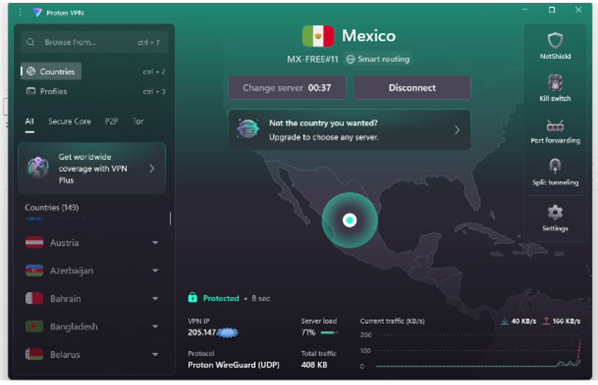
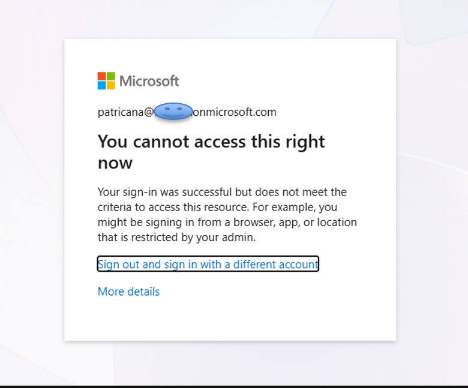
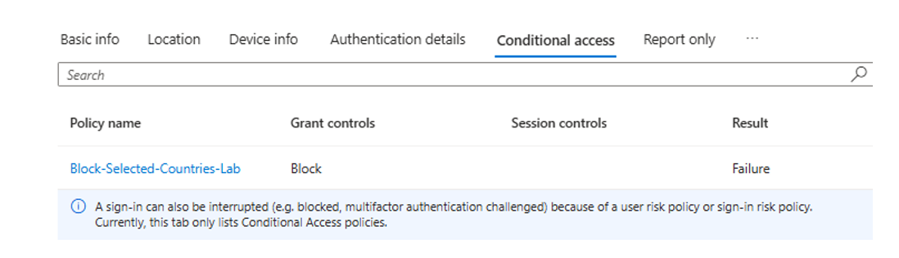
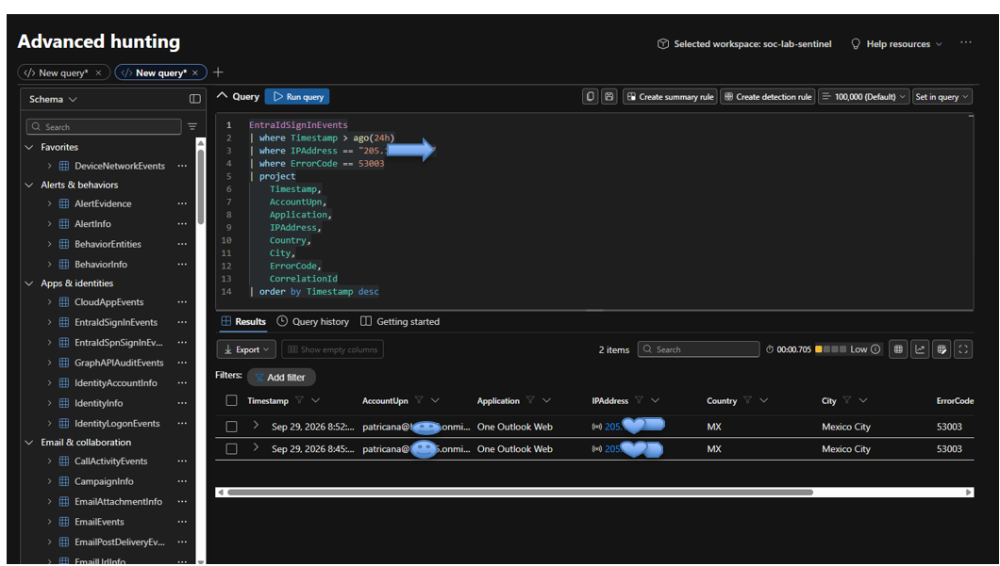

# Microsoft Entra ID Conditional Access – Country Blocking Lab

## Overview

This project documents a hands-on Microsoft Entra ID Conditional Access lab focused on geographic access control.

The goal was to configure a Conditional Access policy that blocks access from a selected country, safely test the policy using a VPN, validate the blocked authentication in Microsoft Entra sign-in logs, and correlate the event using Microsoft Defender XDR Advanced Hunting.

## Lab Objectives

- Configure a Named Location in Microsoft Entra ID
- Create a Conditional Access policy
- Test the policy in Report-only mode before enforcement
- Use a VPN to simulate authentication from a selected geographic location
- Enforce the Conditional Access policy
- Validate the blocked authentication in Entra sign-in logs
- Investigate the event using Defender XDR Advanced Hunting
- Correlate identity events using KQL

## Technologies Used

- Microsoft Entra ID
- Microsoft Entra Conditional Access
- Microsoft Defender XDR
- Advanced Hunting
- Kusto Query Language (KQL)
- Proton VPN
- Microsoft 365

---

# Investigation Workflow

## 1. Geographic Location Simulation

A VPN connection was used in the lab to simulate authentication originating from **Mexico**.

This allowed the geographic Conditional Access rule to be tested without requiring a physical connection from that location.



**Evidence:** The VPN connection placed the test system in Mexico. Sensitive IP information has been sanitized.

---

## 2. Conditional Access Configuration

A Named Location was created for the selected country.

A Conditional Access policy named:

`Block-Selected-Countries-Lab`

was configured for the selected test user and Microsoft cloud resources.

The Grant control was configured to:

**Block access**

The policy was first evaluated in **Report-only** mode before being changed to **On** for enforcement.

---

## 3. Access Block Validation

After the policy was enabled, another authentication attempt was performed while connected through the Mexico VPN location.

Microsoft Entra prevented access to the protected Microsoft 365 resource.



**Result:** The credentials were accepted for authentication, but access to the resource was denied because the request did not satisfy the Conditional Access requirements.

---

## 4. Entra Sign-In Log Investigation

The blocked authentication was then investigated in Microsoft Entra sign-in logs.

The Conditional Access details identified:

- **Policy:** `Block-Selected-Countries-Lab`
- **Grant control:** Block
- **Result:** Failure



This confirmed that the custom Conditional Access policy was responsible for denying access.

Additional sign-in investigation identified:

- **Location:** Mexico
- **Application:** One Outlook Web
- **Conditional Access result:** Failure
- **Error code:** `53003`
- **Access control:** Block

Error `53003` indicated that access was blocked by a Conditional Access policy.

---

# Defender XDR Advanced Hunting

The identity activity was then investigated using **Microsoft Defender XDR Advanced Hunting**.

The `EntraIdSignInEvents` table was queried to identify the blocked authentication events.

## KQL Query

```kusto
EntraIdSignInEvents
| where Timestamp > ago(24h)
| where ErrorCode == 53003
| project
    Timestamp,
    AccountUpn,
    Application,
    IPAddress,
    Country,
    City,
    ErrorCode,
    CorrelationId
| order by Timestamp desc
```

## Hunting Results



The query identified the corresponding identity events and showed:

- **Application:** One Outlook Web
- **Country:** MX
- **City:** Mexico City
- **ErrorCode:** `53003`
- Corresponding identity activity in `EntraIdSignInEvents`
- Events available for correlation through `CorrelationId`

Sensitive account and IP information shown in the hunting results was sanitized before publication.

---

# Investigation Flow

**VPN Mexico Simulation → Conditional Access Evaluation → Access Blocked → Entra Sign-In Validation → Defender XDR Advanced Hunting**

This lab demonstrated how an identity-based security control can be configured, tested, validated, and investigated across Microsoft Entra ID and Microsoft Defender XDR.

---

# Key Findings

Valid credentials alone do not guarantee access to a cloud resource.

Microsoft Entra Conditional Access can evaluate additional signals, including geographic location, before allowing access to a protected resource.

The lab demonstrated that:

- Conditional Access can restrict authentication based on geographic conditions.
- Report-only mode can be used to evaluate a policy before enforcement.
- Named Locations can provide geographic conditions for access decisions.
- Entra sign-in logs provide evidence explaining why access was denied.
- Error code `53003` can identify authentication blocked by Conditional Access.
- Defender XDR Advanced Hunting can be used to investigate Entra identity events using KQL.

---

# Result

## Successful Security-Control Validation

The Conditional Access policy matched the simulated geographic location and prevented access to the protected Microsoft 365 resource.

The blocked authentication was validated in Microsoft Entra sign-in logs and subsequently identified through Microsoft Defender XDR Advanced Hunting.

---

# Skills Demonstrated

`Microsoft Entra ID` • `Conditional Access` • `Identity Security` • `Defender XDR` • `Advanced Hunting` • `KQL` • `Sign-In Log Analysis` • `Security Control Validation`

---

## Lab Environment

This project was completed in an authorized personal Microsoft 365 cybersecurity lab environment for educational and portfolio purposes.

Sensitive account information, tenant information, and IP addresses in the supporting evidence were sanitized before publication.
